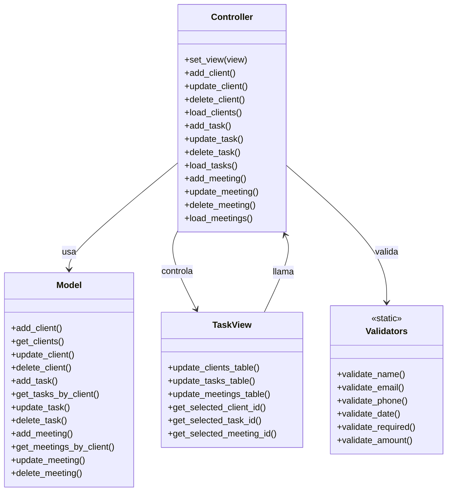
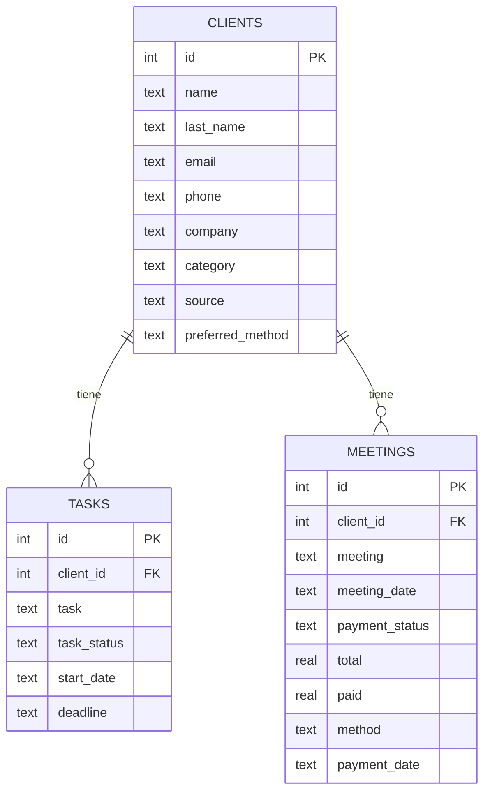

# 📋 Task & Client Manager


---

## 🇪🇸 Español

Sistema CRM de escritorio desarrollado en **Python** con **CustomTkinter**, **SQLite** y arquitectura **MVC**.  
Permite gestionar **clientes**, **tareas** y **reuniones** con una interfaz visual moderna.

📘 **[Manual de Usuario](docs/manual_usuario.md)** — guía completa de uso de la aplicación.

### ✨ Características

- CRUD completo de **clientes** con datos de contacto, categoría y fuente
- CRUD de **tareas** por cliente con fechas y estados
- CRUD de **reuniones** con control de pagos (colores por estado)
- Calendario emergente para selección de fechas
- Búsqueda y ordenamiento en tablas
- Tooltips en celdas con texto largo
- Base de datos SQLite con creación automática
- Validaciones profesionales (email, teléfono, fechas, montos)
- Arquitectura MVC modular

### 🏗 Estructura del proyecto

```
task_client_manager/
├── main.py                  # Punto de entrada
├── controllers/
│   └── controller.py        # Lógica de negocio
├── model/
│   ├── database.py          # Conexión y tablas SQLite
│   ├── model.py             # Capa de datos (CRUD)
│   └── validators.py        # Validaciones
├── view/
│   ├── view.py              # Interfaz gráfica
│   ├── styles.py            # Estilos ttk
│   └── widgets.py           # Calendario emergente
├── utils/
│   └── config.py            # Configuración centralizada
├── data/                    # Base de datos (generada)
├── docs/                    # Documentación
│   └── sphinx/              # Documentación Sphinx
├── tests/                   # Tests
├── requirements.txt
├── LICENSE
└── README.md
```

### 🧩 Diagrama MVC



### 🗄 Base de datos



### 🚀 Instalación y uso

```bash
pip install -r requirements.txt
python main.py
```

La base de datos se crea automáticamente en `data/tasks.db` al iniciar.

### Requisitos

- Python 3.10+
- CustomTkinter
- Tkinter (incluido con Python)

### 🛠 Tecnologías

| Tecnología | Uso |
|-----------|-----|
| Python 3 | Lenguaje principal |
| CustomTkinter | Interfaz gráfica moderna |
| SQLite3 | Base de datos embebida |
| ttk | Tablas y estilos |
| MVC | Patrón de arquitectura |

---

## 🇬🇧 English

Desktop CRM system developed in **Python** with **CustomTkinter**, **SQLite** and **MVC** architecture.  
Manage **clients**, **tasks** and **meetings** with a modern graphical interface.

📘 **[User Manual](docs/manual_usuario.md)** — complete usage guide.

### ✨ Features

- Full CRUD for **clients** with contact data, category and source
- **Tasks** CRUD per client with dates and statuses
- **Meetings** CRUD with payment tracking (color-coded by status)
- Pop-up calendar for date selection
- Search and sort in tables
- Tooltips for long text cells
- SQLite database with auto-creation
- Professional validations (email, phone, dates, amounts)
- Modular MVC architecture

### 🚀 Installation & Usage

```bash
pip install -r requirements.txt
python main.py
```

The database is created automatically at `data/tasks.db` on startup.

### Requirements

- Python 3.10+
- CustomTkinter
- Tkinter (included with Python)

### 🛠 Technologies

| Technology | Usage |
|-----------|-------|
| Python 3 | Main language |
| CustomTkinter | Modern GUI |
| SQLite3 | Embedded database |
| ttk | Tables and styles |
| MVC | Architecture pattern |

---

## 📌 Estado / Status

**Versión 1.0** — Estable / Stable.  
Proyecto final de la Diplomatura en Python — UTN.

## 👩‍💻 Autora / Author

**Penélope J. Nieves**  
Diplomatura en Python – UTN

## 📄 Licencia / License

**Todos los Derechos Reservados.**  
No se permite copiar, distribuir ni modificar sin autorización de la autora.

**All Rights Reserved.**  
Copying, distribution or modification without author's permission is prohibited.
